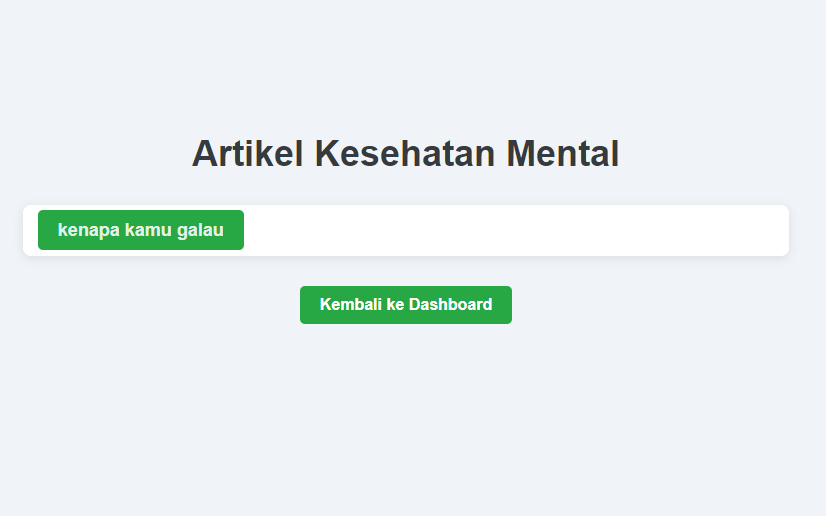
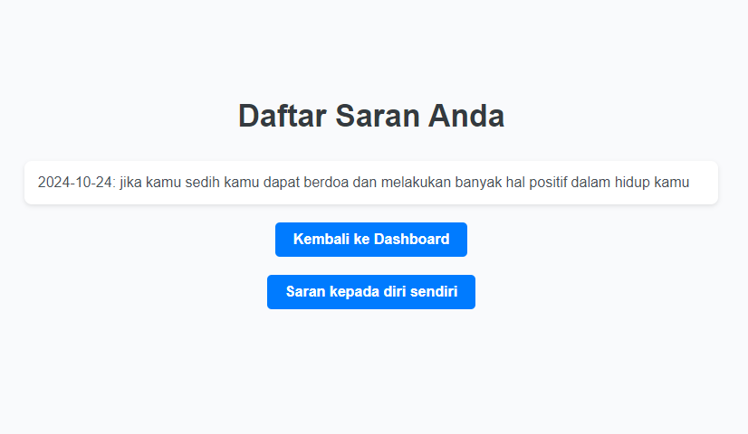
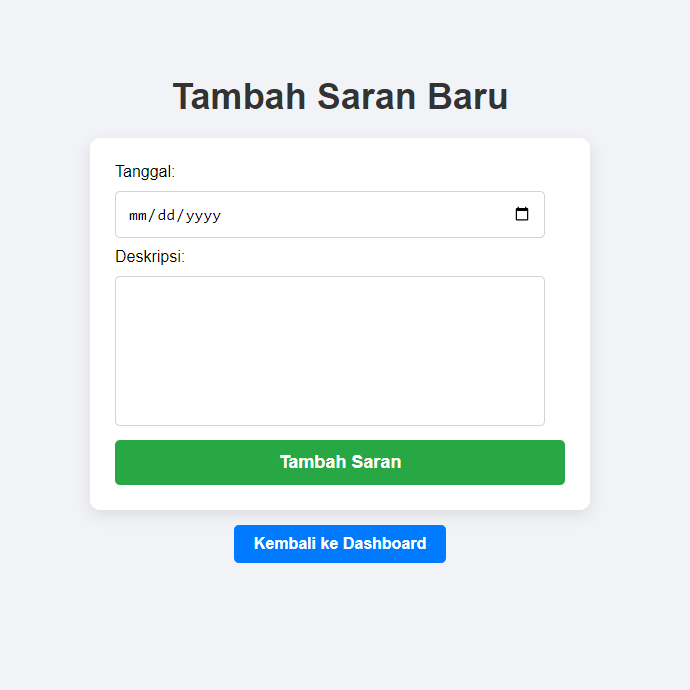

# Aplikasi Kesehatan Mental

Aplikasi ini dirancang untuk membantu pengguna dalam memantau kesehatan mental mereka. Pengguna dapat melakukan login, mendaftar, menambahkan suasana hati, dan melihat saran serta artikel terkait kesehatan mental.

## Fitur

- **Login**: Pengguna dapat masuk ke aplikasi dengan email dan password.
- **Registrasi**: Pengguna baru dapat mendaftar untuk membuat akun.
- **Dashboard**: Halaman utama yang memberikan akses ke fitur lain dalam aplikasi.
- **Tambah Suasana Hati**: Pengguna dapat mencatat suasana hati mereka.
- **Daftar Artikel**: Pengguna dapat melihat artikel terkait kesehatan mental.
- **Lihat Saran**: Pengguna dapat melihat saran yang telah mereka buat.
- **Tambah Saran**: Pengguna dapat memberikan saran untuk diri mereka sendiri.

## Struktur Aplikasi

### Halaman

1. **Login**
   - URL: `http://localhost/app/Minggu-2/Selasa/mentalhelth/login.php`
   - Deskripsi: Halaman untuk login pengguna.
   

2. **Registrasi**
   - URL: `http://localhost/app/Minggu-2/Selasa/mentalhelth/register.php`
   - Deskripsi: Halaman untuk pengguna baru mendaftar.

3. **Dashboard**
   - URL: `http://localhost/app/Minggu-2/Selasa/mentalhelth/dashboard.php`
   - Deskripsi: Halaman utama aplikasi setelah login.
   

4. **Tambah Suasana Hati**
   - URL: `http://localhost/app/Minggu-2/Selasa/mentalhelth/add_mood.php`
   - Deskripsi: Halaman untuk pengguna menambahkan suasana hati mereka.
   

5. **Daftar Artikel**
   - URL: `http://localhost/app/Minggu-2/Selasa/mentalhelth/articles.php`
   - Deskripsi: Halaman yang menampilkan artikel kesehatan mental.
   

6. **Lihat Saran**
   - URL: `http://localhost/app/Minggu-2/Selasa/mentalhelth/view_saran.php`
   - Deskripsi: Halaman untuk melihat saran yang telah diberikan oleh pengguna.
    
7. **Tambah Saran**
   - URL: `http://localhost/app/Minggu-2/Selasa/mentalhelth/add_saran.php`
   - Deskripsi: Halaman untuk pengguna menambahkan saran untuk diri mereka sendiri.
## Teknologi yang Digunakan

- **PHP**: Bahasa pemrograman untuk backend.
- **MySQL**: Database untuk menyimpan data pengguna, suasana hati, artikel, dan saran.
- **HTML/CSS**: Untuk membuat antarmuka pengguna.

